# ⚡ SonicArena ⚡
*A high-velocity, move-to-earn GPS strategy game built on the idea of Sonic Blockchain*

<div align="center">


[](https://github.com/yourusername/sonic-arena)
[](https://testnet.sonicscan.org/)
[](https://developer.apple.com/ios/)

</div>

---

## 🌐 **ENTER THE DIGITAL BATTLEGROUND**

> *"In 2025, the boundary between physical and digital reality dissolves. Every step you take, every path you forge, becomes a weapon in the greatest territorial war ever conceived."*

**SonicArena** transforms your city into a cybernetic arena where movement equals power. This isn't just a game—it's the future of location-based warfare, where your real-world velocity generates tangible blockchain value.

### 💫 **The Quantum Loop**

<table align="center">
<tr>
<td align="center" width="33%">

<br><strong>🏃‍♂️ EMIT</strong><br>
<sub>Generate quantum trails through reality</sub>
</td>
<td align="center" width="33%">

<br><strong>⚔️ ENGAGE</strong><br>
<sub>Shatter rival frequencies in high-velocity combat</sub>
</td>
<td align="center" width="33%">

<br><strong>🏦 SYNC</strong><br>
<sub>Convert captured zones into $SONIC tokens</sub>
</td>
</tr>
</table>

---

## ⚡ **CORE SYSTEMS**

### 🔥 **Trail Emission Protocol**
Your movement through reality generates luminous **Sonic Trails**—quantum pathways that exist simultaneously in physical and digital space. Each step amplifies your frequency signature.

### 💥 **Zone Warfare Mechanics**
- **Trail Intersection**: Cross an opponent's active path to trigger a **Frequency Shatter**
- **Resonance Loops**: Return to your own trail to claim enclosed territories
- **Velocity Multipliers**: Faster movement generates more potent trail energy

### 🌐 **Synchronization Nodes**
Strategic landmarks scattered throughout reality serve as **Resonance Nodes**—quantum bridges where digital conquest becomes blockchain wealth.

---

## 🛸 **TECHNOLOGY MATRIX**

<div align="center">

| **Layer** | **Technology** | **Purpose** |
|-----------|----------------|-------------|
| 📱 **Neural Interface** | Swift + MapKit + Sonic SDK | Real-time movement tracking & visualization |
| ⚡ **Processing Core** | FastAPI (Python) | Quantum game logic processing |
| 🔐 **Identity Matrix** | Supabase Auth | Secure player authentication |
| ⛓️ **Value Chain** | Sonic Blockchain | Immutable reward distribution |
| 💾 **Memory Bank** | PostgreSQL | Persistent game state |

</div>

### 🏗️ **Hybrid Architecture Flow**

```mermaid
graph TD
    A[📱 iOS Neural Interface] --> B[🔐 Supabase Authentication]
    B --> C[📡 GPS Quantum Capture]
    C --> D[⚡ FastAPI Processing Core]
    D --> E[🎯 Game Logic Engine]
    E --> F[⛓️ Sonic Blockchain Bridge]
    F --> G[💰 $SONIC Token Distribution]
    G --> H[📊 Wallet Balance Update]
```



---

## 🚀 **INITIALIZATION SEQUENCE**

### **Prerequisites Archive**
- 🍎 Xcode 15+ (Neural Interface Compiler)
- 📱 iOS Device (Movement Sensor Array)
- 🐍 Python 3.9+ & Poetry (Core Processing)
- 🛡️ Supabase Account (Identity Verification)
- ⚡ Sonic Testnet Access (Blockchain Gateway)

### **Phase 1: Environment Configuration**

Create your mission parameters in `backend/.env`:

```bash
# === SUPABASE NEURAL LINK ===
SUPABASE_URL="YOUR_QUANTUM_GATEWAY_URL"
SUPABASE_ANON_KEY="YOUR_ANONYMOUS_ACCESS_KEY"
SUPABASE_JWT_SECRET="YOUR_NEURAL_SIGNATURE_SECRET"

# === SONIC BLOCKCHAIN MATRIX ===
SONIC_RPC_URL="YOUR_SONIC_TESTNET_GATEWAY"
DEVELOPER_WALLET_PRIVATE_KEY="YOUR_QUANTUM_WALLET_SIGNATURE"
```

### **Phase 2: Core System Activation**

```bash
# Navigate to the processing core
cd backend/

# Install quantum dependencies
poetry install

# Initiate the processing matrix
poetry run uvicorn app.main:app --host 0.0.0.0 --port 8000 --reload
```

🟢 **Core Systems Online**: `http://localhost:8000`

### **Phase 3: Neural Interface Deployment**

```bash
# Navigate to neural interface
cd ios/

# Install interface dependencies (if using CocoaPods)
pod install

# Launch in Xcode
open SonicArena.xcworkspace
```

Configure your quantum credentials in `Config.swift` and deploy to your iOS device.

---

## 🎮 **MISSION BRIEFING: PROOF-OF-CONCEPT**

<div align="center">

</div>

### **Mission Objectives**

1. **🔓 Neural Link Establishment**
   - Initialize your digital identity
   - Quantum wallet auto-generation

2. **🌐 Trail Emission Activation**
   - Navigate to Map Interface
   - Begin movement to generate Sonic Trails
   - Watch reality bend to your will

3. **🎯 Resonance Node Discovery**
   - Locate strategic synchronization points
   - Plan your approach vector

4. **💰 Quantum Synchronization**
   - Interface with Resonance Node
   - Trigger blockchain value transfer
   - Receive 10 $SONIC test tokens

5. **📊 Victory Confirmation**
   - Verify token acquisition in Wallet Interface
   - Witness your digital conquest manifest

---

## 🌌 **FUTURE WARFARE PROTOCOLS**

<div align="center">

### **PHASE ALPHA: FOUNDATION** ✅
*Proof-of-Concept Complete*

### **PHASE BETA: EXPANSION** 🔄
- [ ] **H3 Hexagonal Dominion System**: Precision territory mapping
- [ ] **Multiplayer Quantum Entanglement**: Real-time opponent visualization
- [ ] **Faction Wars**: Team-based territorial conquest

### **PHASE GAMMA: ASCENSION** 🔮
- [ ] **Neural Leaderboards**: Global dominance rankings
- [ ] **NFT Combat Enhancements**: Cosmetic trail modifications
- [ ] **Anti-Spoof Defense Matrix**: GPS integrity validation

### **PHASE OMEGA: MAINNET** 🌟
- [ ] **Full Security Audit**: Military-grade protection
- [ ] **Sonic Mainnet Deployment**: Real economic warfare
- [ ] **Global Arena Activation**: Worldwide territorial battles

</div>

---

## 🤖 **JOIN THE RESISTANCE**

This quantum experiment represents the bleeding edge of location-based blockchain gaming. While formal contributions are currently restricted during the PoC phase, brave souls are welcome to:

- 🔍 **Explore the codebase** and understand our quantum architecture
- 🐛 **Report anomalies** through the issue tracking system
- 🍴 **Fork the reality** to conduct your own experiments

---

## ⚖️ **LEGAL MATRIX**

This project operates under the MIT License - freedom to explore, modify, and distribute within legal parameters.

---

<div align="center">

**⚡ PREPARE FOR DIGITAL WARFARE ⚡**

*The future of territorial conquest has arrived. Every step matters. Every path is power.*

[](https://testnet.sonic.com)
[](https://discord.gg/sonicarena)
[](https://twitter.com/sonicarena)

</div>

---

<sub>🌐 Built for the Sonic Blockchain ecosystem | ⚡ Powered by quantum movement | 🔮 The future is now</sub>
